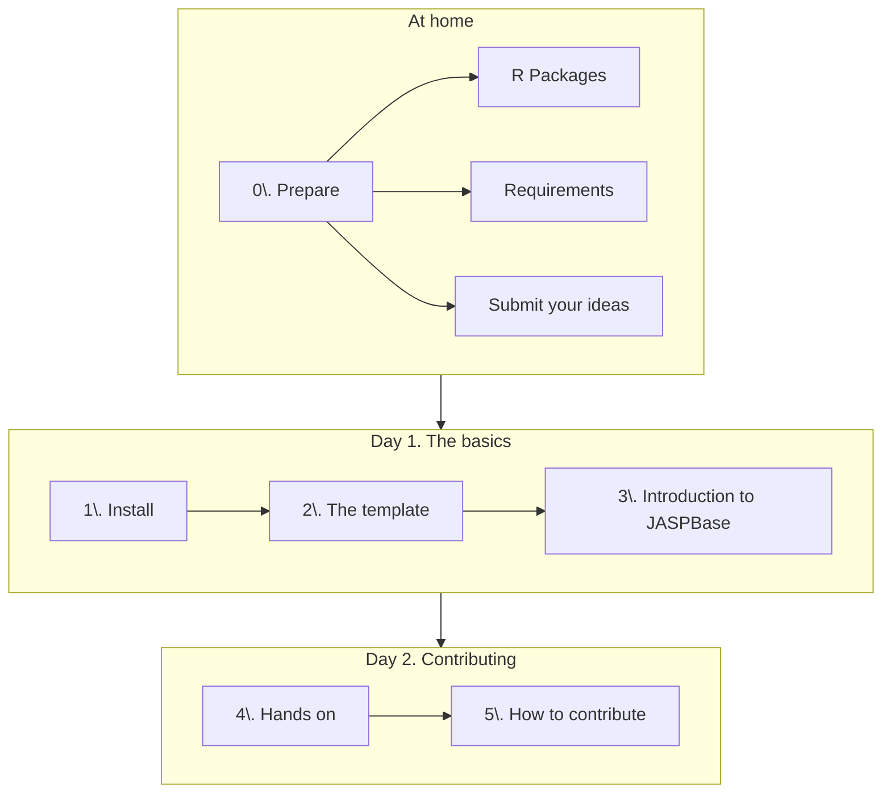

## Diagram

## At home
### 0. Prepare
JASP builds on top of a number of stepping stones, both technical and intellectual. In order to keep the hackathon feasible, we'll need to ask our attendants to come prepared. Specifically, we'll need:
#### Experience with R
Our attendants will need at least intermediate experience in R. Being able to write a custom function is a must. 

Consider asking them to do this exercise when they apply for the hackathon:

> [!check] Exercise
> Write a **function** that takes the radius ($r$) of a circle and returns its area. ($A$). Call it `circle_area`.
> 
> Hint: $A = \pi r^2$.
#### Requirements
Something we learned from the interaction with our volunteers is that JASP often requires its dependencies to be very up-to-date. Most of these updates are automatic, but can be very slow. We should highly encourage our attendants to update their systems beforehand.

Unfortunately, this can be challenging. We don't have an exhaustive list of dependencies, plus the variety of operating systems _de facto_ multiplies this complexity by ~3 (Linux, Mac, Windows, ...). A tentative list would be:

- R
	- `stringi` package
	- `tidyverse`?
- RStudio
- JASP
#### Submit your ideas
Our attendants will very likely have a module in mind. Invite them to share their idea beforehand. This serves a three-fold purpose:

1. As a check for us
2. As a motivator for them
3. As an invitation for those who don't know yet

> [!check] Give them hints
> Regarding those who don't know yet, remind them that all R packages are open source, so they can create a JASP interface for any package they like.

## Day 1. The basics
#### 1. Install
Just installing JASP and setting it up in developer mode can be a challenge. It's probably a good idea to do it together, and make sure we are all at the same page before jumping into the template.
#### 2. The template
Install the template and use it as an introduction to the `qml` language.
#### 3. JASPBase
Introduce the key concept of how to communicate between the interface and R.

From the technical point of view, this is the most challenging part of the hackathon. Instead of trying to provide a deep, exhaustive overview of `JASPBase`, let's keep it short and practical, and rely on the template as much as possible.

> [!check] Checkpoint
> At this point the attendants will have the basic knowledge to work independently on their own modules.

## Day 2. Contributing
#### 4. Hands on session
The most important session of the hackathon. The attendants will put together all we learned with their own modules, while we help.

> [!warning] Helpers
> We'll need a reasonable number of helpers for this to work. I'll recommend something around 1 helper per 4 attendants.
#### 5. How to contribute
Point them to the contribution system. If they don't know `git` and `GitHub`, point them to external materials.

By then, I hope the contribution system to be as self-explanatory as possible. It is the less we can do for our volunteer contributors!
